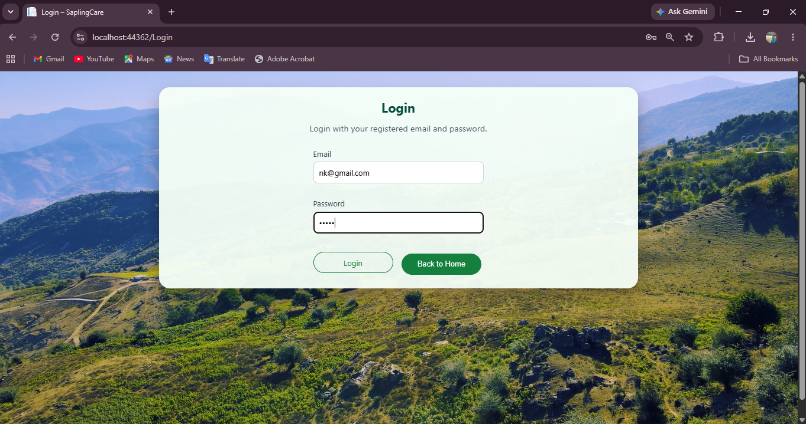
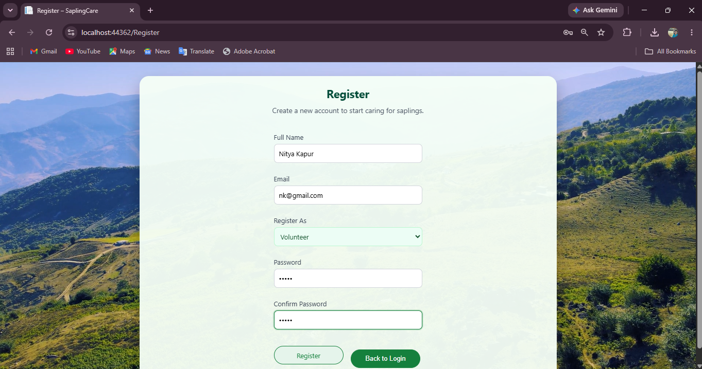
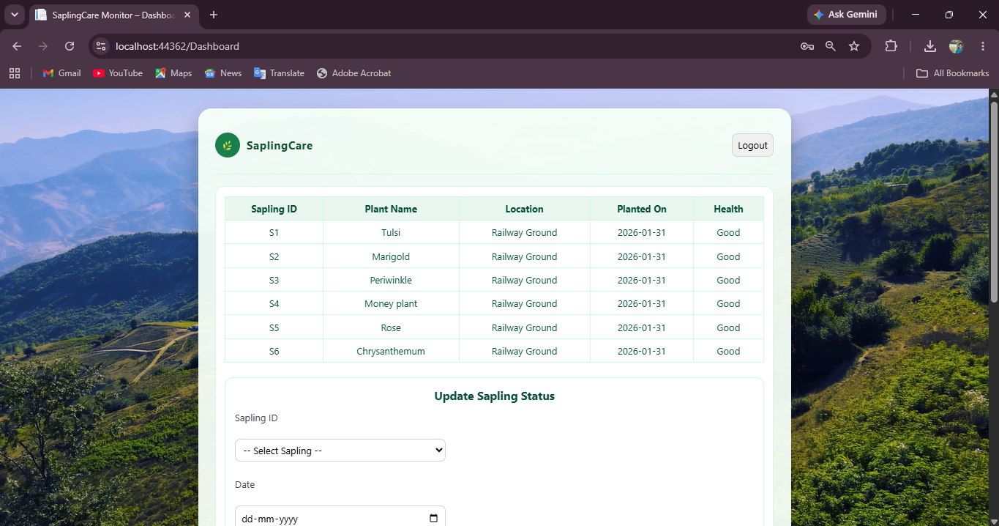
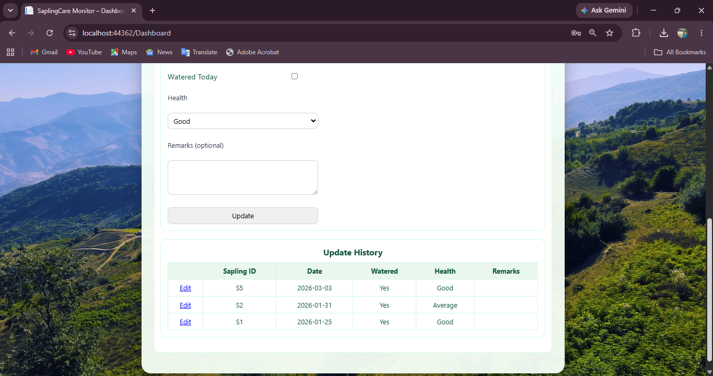
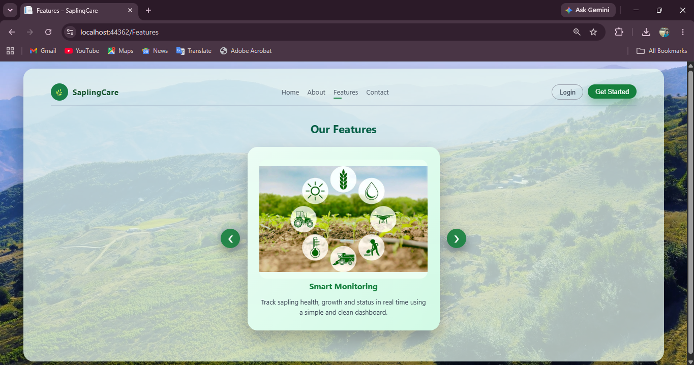
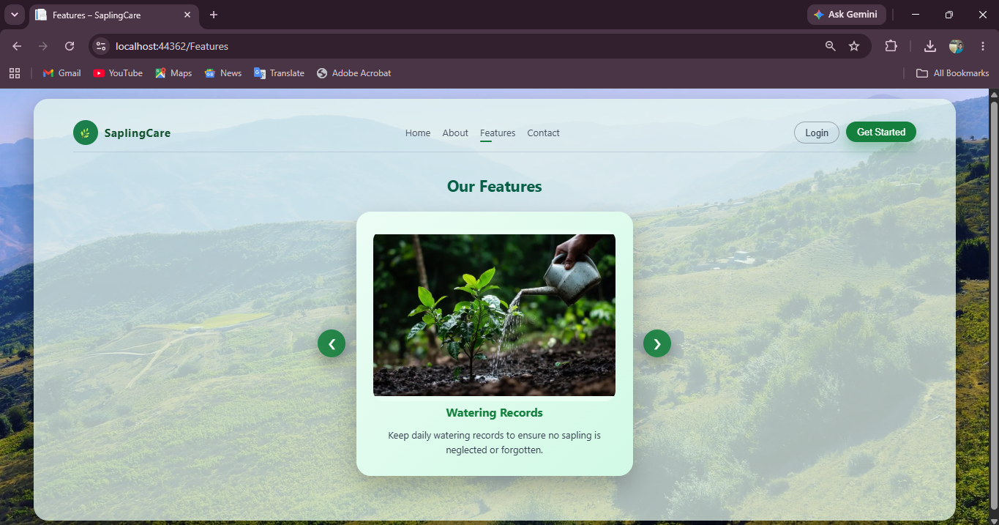
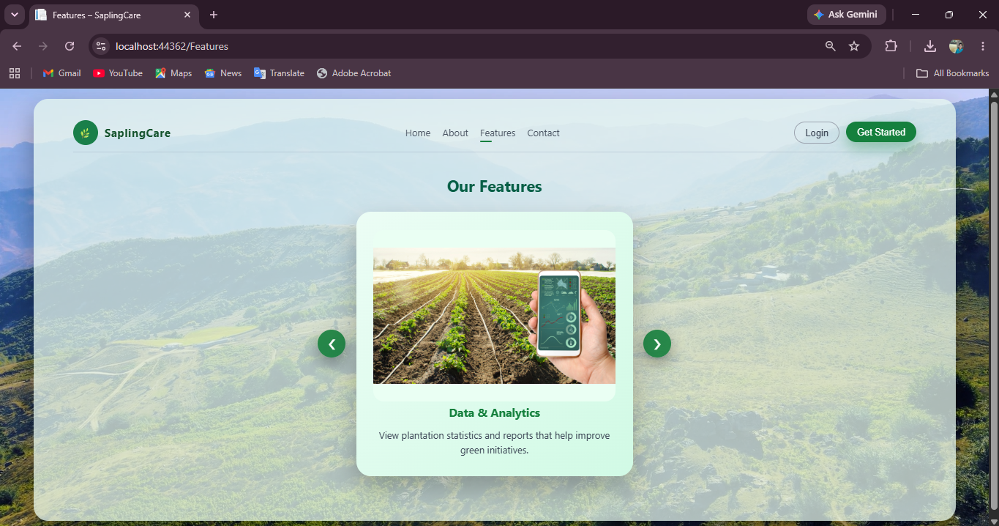
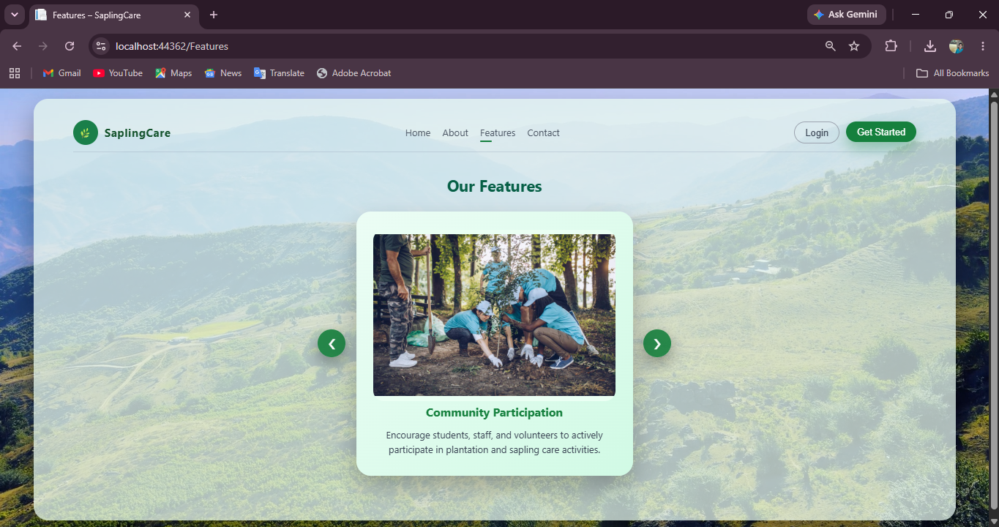
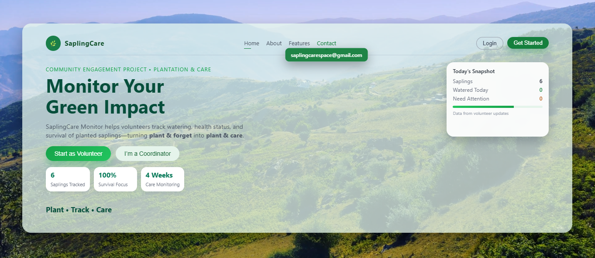

# 🌱 Sapling Care

Sapling Care is a web-based plantation and sapling monitoring platform developed to promote environmental sustainability and support plantation initiatives. The project aims to provide a digital solution for managing plantation-related information and encouraging tree conservation efforts.

## 📖 Project Overview

Environmental conservation requires not only planting trees but also monitoring and maintaining them over time. Sapling Care was developed to create a platform that supports plantation awareness and sapling management through an easy-to-use web interface.

## ✨ Features

* User-friendly web interface
* Plantation and sapling information management
* Responsive design for different devices
* Organized presentation of plantation-related data
* Easy navigation and accessibility

## 🛠️ Technologies Used

* ASP.NET Web Forms
* C#
* HTML5
* CSS3
* JavaScript

## 🎯 Objectives

* Promote environmental awareness.
* Support plantation and sapling monitoring activities.
* Provide a centralized platform for plantation-related information.
* Encourage sustainable green initiatives through technology.

## 🌍 Impact

Sapling Care contributes to environmental sustainability by supporting plantation efforts and helping users stay connected with tree conservation activities through a digital platform.

## 📸 Screenshots

### 🏠 Landing Page

### 🔐 Login Page

### 📝 Registration Page

### 📊 Dashboard

### ℹ️ About Page

### ⭐ Features Page

### 📞 Contact Page

## 🎥 Project Demo

Watch the working demo of SaplingCare:

👉 [Click here to watch demo video](https://drive.google.com/file/d/1Z_MxxQmk_xe0UZgLKDRAlDDC2Aul42XU/view?usp=drive_link)

👩‍💻 Developed By

Manjiri Chavan
 
